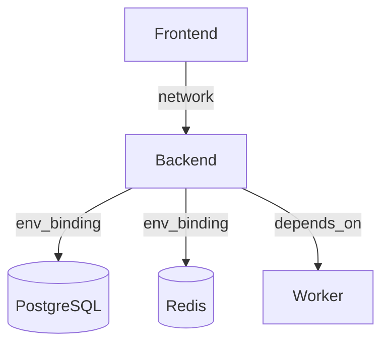

# FlowOps

Visual infrastructure architecture designer that turns cloud topology diagrams into deployable configuration.

---

## Overview

FlowOps bridges the gap between infrastructure design and deployment configuration. Instead of manually writing and maintaining complex YAML manifests, FlowOps allows developers to visually design their application architecture on an interactive canvas, validate their topology in real-time, and instantly generate target-specific configuration files.

**The FlowOps Pipeline:**  
Visual Architecture → Relationship Understanding → Architecture Validation → Target Configuration Generation

---

## Why FlowOps?

Infrastructure configuration often requires translating architecture decisions into platform-specific files. This process is prone to drift, syntax errors, and misconfigured connections. 

FlowOps provides a canonical domain model between architecture design and deployment configuration, allowing you to:
- **Design visually:** Drag and drop services onto a canvas to map out your infrastructure.
- **Validate architecture:** Catch missing runtimes, isolated nodes, or dangling connections before deployment.
- **Keep relationships explicit:** Define exactly *how* services connect (e.g., network access vs. environment binding).
- **Generate target-specific configuration:** Instantly compile the visual architecture into working configuration files.
- **Switch deployment targets:** Export to a different platform without rebuilding the underlying architecture.

---

## Features

### Visual Infrastructure Canvas
- Interactive React Flow-based workspace.
- Service nodes with drag-and-drop positioning.
- Directed connections representing infrastructure dependencies.
- Node and connection selection.
- Connection creation and deletion.
- Configurable service properties (runtimes, exposed ports, commands).

### Architecture Validation
Real-time, framework-agnostic validation engine that catches structural issues instantly:
- Missing compute runtimes.
- Dangling connections.
- Self-referencing connections.
- Duplicate environment variables.
- Isolated or disconnected services.

### Connection Intents
FlowOps models relationships with explicit semantic intents:
- `network`: Services communicate securely over an internal network.
- `env_binding`: Target service credentials/URLs are injected into the source's environment.
- `depends_on`: Explicit startup or deployment sequencing.

### Configuration Generation
The same visual architecture generates target-specific configuration. 
Current exporters:
- **Zerops**
- **Docker Compose**

### Live Configuration Preview
- Instantly compiles the visual graph into infrastructure-as-code.
- Includes a live, read-only Monaco Editor preview with syntax highlighting.

### Architecture Templates
Start building instantly with pre-configured, fully editable templates:
- **Web App:** Frontend, API, and PostgreSQL database.
- **Production API:** API with cache, worker, and database.
- **Full Stack:** Complete application stack with object storage.

Templates create complete architectures instantly, generate fresh IDs, and remain fully editable as starting points for experimentation.

### Project Persistence
- **Auto-Save:** Continuous browser `localStorage` persistence.
- **Import/Export:** Download your architecture as a `.json` file and share it or load it on another machine.
- **Validation:** Strict Zod schema validation during project import.
- **Reset:** Safe project reset and new project behavior.

### Diagnostics
Clickable diagnostics in the validation panel automatically focus the affected service or connection on the canvas for quick resolution.

---

## Architecture

FlowOps is built on a unidirectional, framework-independent data flow:

**UI (React Flow)** → **Zustand (Canonical State)** → **Validation Engine & Exporters** → **Target Configuration**

The FlowOps project model in Zustand acts as the single source of truth. React Flow handles transient visual states (dragging, selection), but all canonical mutations are processed by the store and validated synchronously.

---

## Supported Targets

| Target | Status | Output |
|---|---|---|
| Zerops | Available | YAML |
| Docker Compose | Available | YAML |

---

## Supported Services

| Service Type | Category | Purpose |
|---|---|---|
| **Frontend** | Compute | Web UI, client applications, or static sites. |
| **Backend** | Compute | REST/GraphQL APIs and server applications. |
| **Worker** | Compute | Background task processing and async queues. |
| **PostgreSQL** | Managed | Relational database storage. |
| **Redis** | Managed | In-memory data store and caching. |
| **Storage** | Managed | Object storage and asset buckets. |

---

## Tech Stack

| Category | Technology |
|---|---|
| **Framework** | Next.js, React |
| **Language** | TypeScript |
| **State Management**| Zustand |
| **Canvas** | React Flow |
| **Validation** | Zod |
| **Styling** | Tailwind CSS |
| **Editor** | Monaco Editor |
| **Icons** | Lucide |
| **Serialization** | `yaml` |

---

## Getting Started

### Prerequisites
- Node.js
- `pnpm`

### Installation

Clone the repository and install dependencies:
```bash
pnpm install
```

### Development

Start the local development server:

```bash
pnpm dev
```

### Type Checking & Linting

```bash
pnpm tsc --noEmit
pnpm lint
```

---

## How It Works

1. **Create a project:** Start fresh or load an Architecture Template.
2. **Add services:** Drag services from the palette onto the canvas.
3. **Connect services:** Draw edges between nodes and configure intents.
4. **Configure:** Set runtimes, ports, environment variables, and commands.
5. **Review architecture diagnostics:** Ensure there are no validation errors.
6. **Select an export target:** Choose Zerops or Docker Compose.
7. **Inspect generated configuration:** View the live preview in the Monaco Editor.
8. **Export/copy the configuration:** Use the generated YAML for your deployment.

---

## Example Workflow

FlowOps visually represents complex architectures. For example, a Production API topology:



FlowOps maps this visual model to a canonical JSON schema, validates it, and generates the exact target configuration required to run it.

---

## Project Structure

```text
src/
├── app/               # Next.js application shell and layout
├── components/        # UI components (Canvas, Sidebars, Exporter, Templates)
├── engine/            # Core business logic
│   ├── exporters/     # Configuration generators (Zerops, Compose)
│   ├── schema/        # Zod validation schemas
│   ├── templates/     # Prebuilt architecture definitions
│   └── validation/    # Architectural rule engine
├── lib/               # Utilities (Persistence, JSON parsing)
├── store/             # Zustand canonical project state
└── types/             # TypeScript domain interfaces

```

---

## Roadmap

* Additional deployment targets.
* Richer architecture templates.
* Additional infrastructure primitives.
* Improved export capabilities.

---

## Contributing

1. Fork the repository.
2. Install dependencies with `pnpm install`.
3. Create a feature branch.
4. Make your changes.
5. Ensure all checks pass (`pnpm tsc --noEmit` and `pnpm lint`).
6. Submit a Pull Request.
